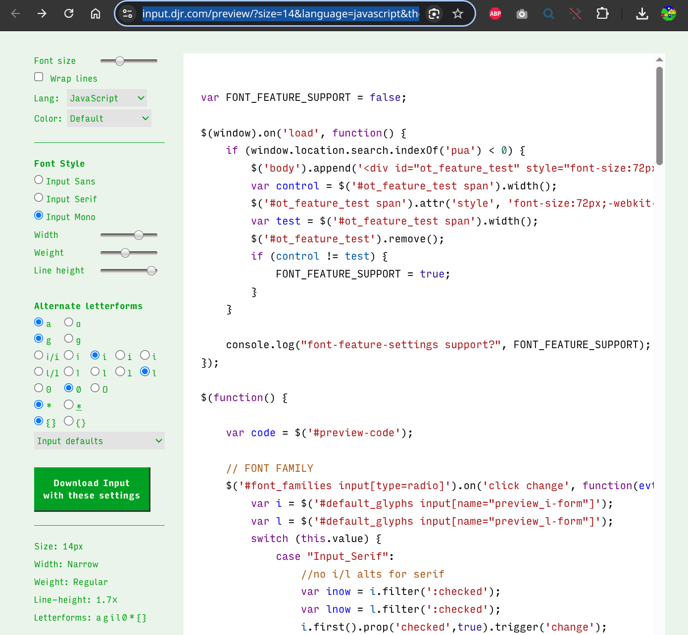

# My personal coding fonts

I use [Input fonts](https://input.djr.com/preview/?size=14&language=javascript&theme=default&family=InputMono&width=300&weight=400&line-height=1.7&a=0&g=0&i=serifs&l=serifs_round&zero=slash&asterisk=0&braces=0&preset=default&customize=please) for coding due to customizable characters:


* Clearly differentiated '{}' from '()'
* Clean '@' symbol (better than Fira Code)
* Curved 'i' and 'l' for elegance

I patch it as a ["Nerd font"](https://gist.github.com/ismailshak/72da606d43ac57a19bc6d98285e56f3b) for ["Oh My Posh"](https://ohmyposh.dev/) terminal compatibility:
```sh
podman run -v ~/tmp/input-mono:/in:ro,z -v ~/tmp/patched-fonts:/out:z nerdfonts/patcher --careful --complete --adjust-line-height
```

You can download the patched fonts in the [fonts](./fonts/) folder
